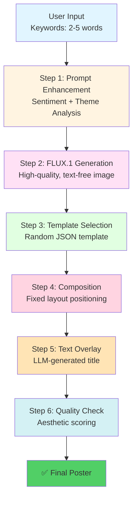
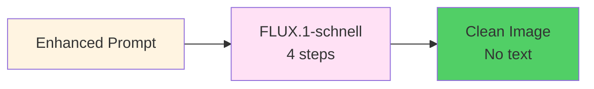
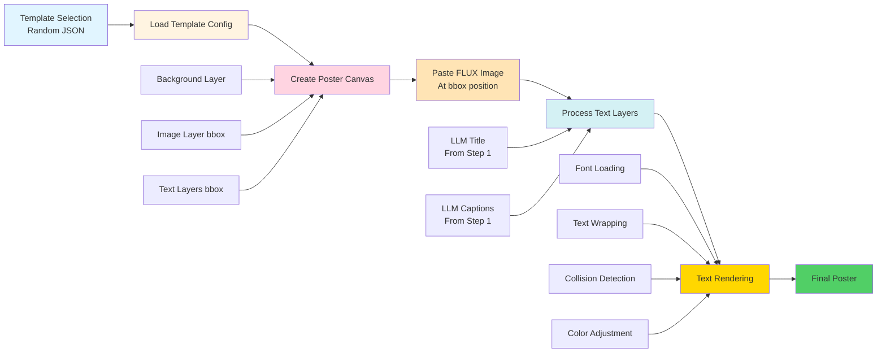
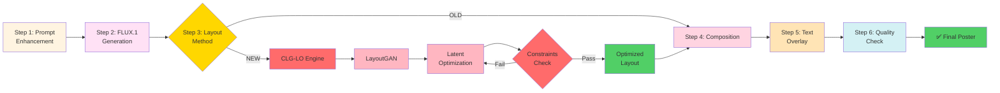
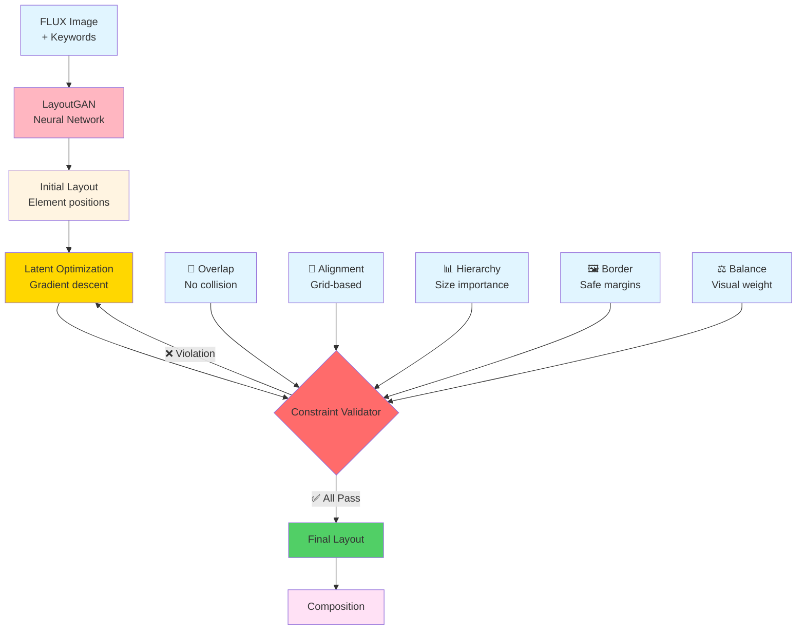
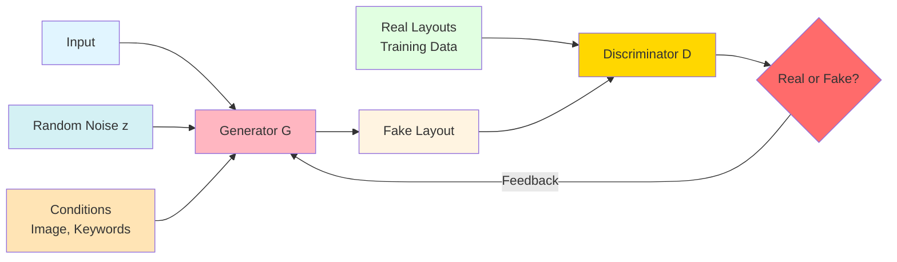
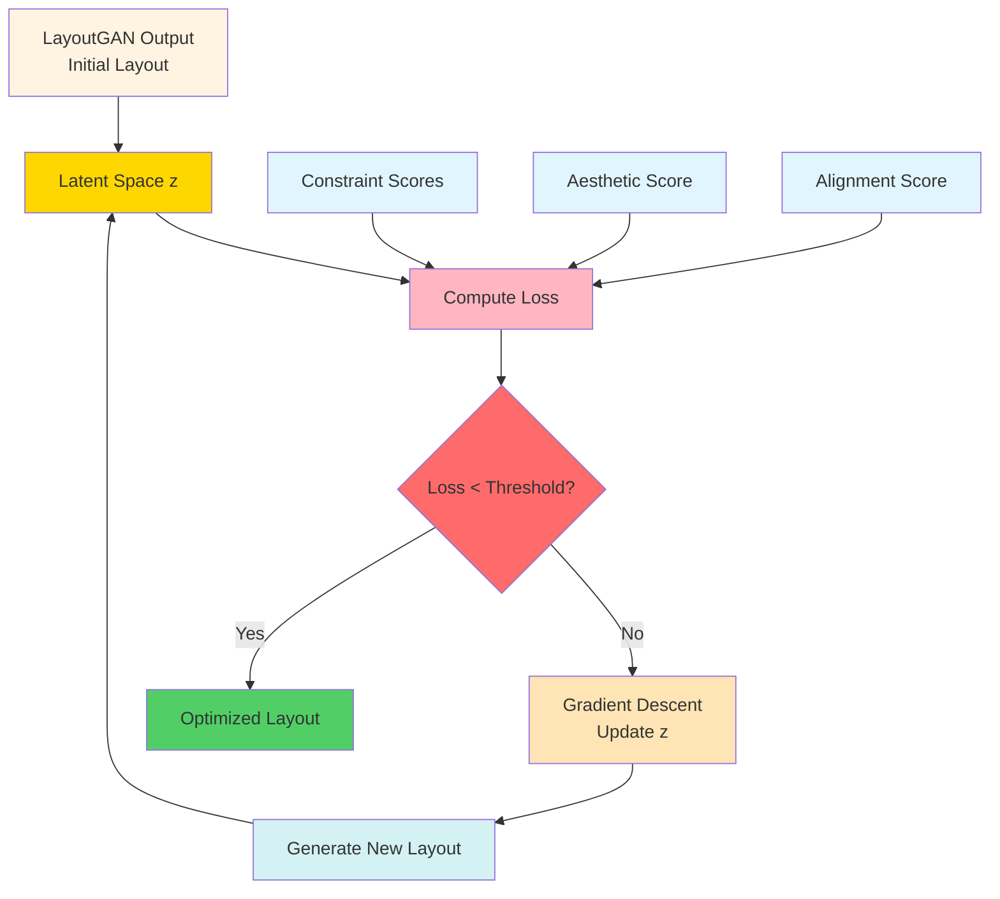
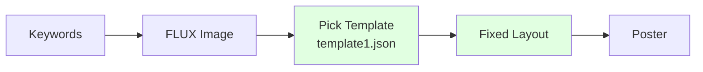
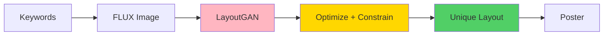
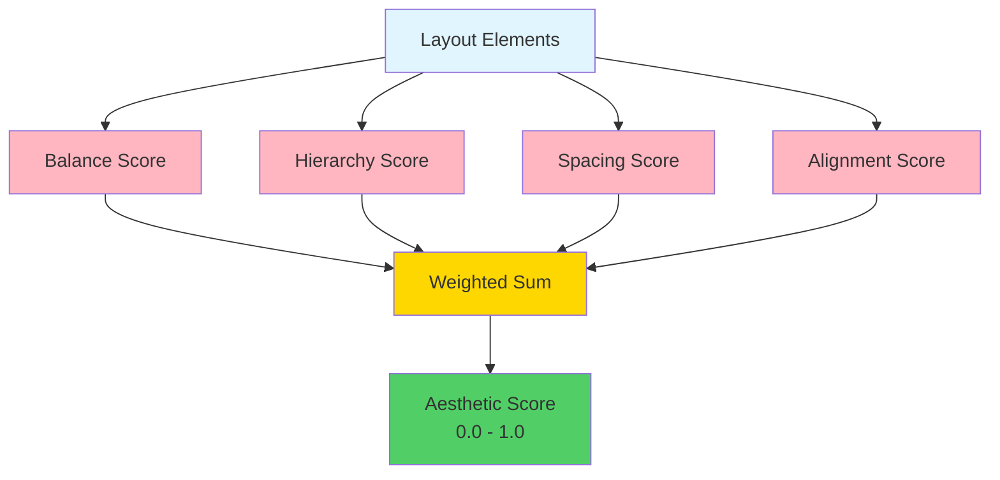

# Key2Poster: AI Poster Generator
## Presentation Slides

---

## 📋 CURRENT VERSION: app_template.py

### Complete Workflow



### Performance
- ⚡ **Speed**: 12-18 seconds total
- 🎯 **Consistency**: High (fixed templates)
- 🎨 **Variety**: Limited (template count)

---

## 💡 Important Features (Current)

### 1. **Prompt Enhancement** (Teammate's Work: Concept Expander)
```mermaid
graph TD
    A[Keywords<br/>"anime love story"] --> B[LLM Processing<br/>GPT-4o-mini]
    
    B --> C[Poster Type Analysis<br/>Movie/Event/Music]
    C --> D[Style Guidance<br/>Cinematic/Vibrant]
    D --> E[Spatial Positioning<br/>Layout hints]
    E --> F[Paint Style<br/>Digital watercolor]
    
    F --> G[Enhanced Description<br/>45 words max]
    G --> H[Story Title<br/>LLM-generated]
    G --> I[Captions<br/>Promotional text]
    
    style A fill:#e1f5ff
    style B fill:#fff4e1
    style C fill:#ffe1f5
    style D fill:#ffd4e1
    style E fill:#ffe4b5
    style F fill:#d4f1f4
    style G fill:#51cf66
    style H fill:#ffb6c1
    style I fill:#ffb6c1
```

**Key Capabilities:**
- 🎨 **Poster Type Adaptation** - 10 types (movie, music, event, sports, etc.)
- 📐 **Spatial Positioning** - Explicit layout hints ("upper left", "centered")
- 🎭 **Style Guidance** - Type-specific visual direction
- 📝 **Text Generation** - Story titles + promotional captions
- 🖌️ **Paint Style Integration** - Seamless style application

**Example:**
```
Input: "anime love story japanese"
Output: {
  "description": "In the upper third, cherry blossoms drift 
                  across a sunset sky. Centered, two silhouettes 
                  face each other in the middle ground, soft pink 
                  light radiating warmth, digital watercolor style.",
  "story title": "Sakura Hearts",
  "captions": ["Coming Soon", "A tale of eternal love"]
}
```

### 2. **FLUX.1 Image Generation**

- GPU-accelerated (RTX 3090: ~10s)
- Text-free, high-quality output
- Uses enhanced description from Step 1

### 3. **Template System**
```json
{
  "size": [720, 1080],
  "layers": [
    {"name": "Background", "bbox": [0, 0, 720, 1080]},
    {"name": "Image", "bbox": [54, 59, 655, 873]},
    {"name": "Text", "bbox": [240, 930, 472, 989]}
  ]
}
```
- Pre-defined JSON layouts
- Professional, consistent design
- Easy to add new templates

### 4. **Template Composition** (My Work)


**Key Features:**
- 📐 **JSON-driven Layout** - All positions defined in template
- 🎨 **3-Layer System** - Background + Image + Text
- 🔤 **Smart Text Rendering**:
  - Auto wrapping to fit bbox
  - Collision detection
  - Auto-contrast for readability
  - Multi-alignment (left/center/right)
- 🖼️ **FLUX Integration** - Seamless placement
- 📝 **LLM Text** - From Prompt Enhancement (Step 1)

**Template Structure:**
```json
{
  "size": [720, 1080],
  "background_color": "#faefcf",
  "layers": [
    {"name": "Image", "bbox": [54, 59, 655, 873]},
    {"name": "Title", "bbox": [240, 930, 472, 989]},
    {"name": "Caption1", "bbox": [100, 1000, 620, 1050]}
  ],
  "fonts": {
    "title": {"family": "Graduate-Regular.ttf", "size": 37, 
              "color": "#043bb4", "align": "center"},
    "caption": {"family": "Graduate-Regular.ttf", "size": 20, 
                "color": "#043bb4", "align": "center"}
  }
}
```

**Composition Pipeline:**
1. **Template Selection** - Random JSON from `templates/`
2. **Layer Parsing** - Background + Image bbox + Text bboxes
3. **Canvas Creation** - Solid color background
4. **FLUX Placement** - Paste at Image layer position
5. **Text Processing** - Extract LLM title/captions from Step 1
6. **Smart Rendering** - Font + Wrapping + Collision + Contrast
7. **Export** - Final composed poster

### 5. **Interactive Canvas Editor**
- Drag & resize elements
- Live text editing
- Export to PNG

---

## 🚀 FUTURE VERSION: app_ai_layout.py

### Complete Workflow (with Comparison)



### Performance Comparison
| Metric | Template (OLD) | CLG-LO (NEW) |
|--------|---------------|--------------|
| Speed | 12-18s | 15-23s |
| Variety | Limited | Infinite |
| Adaptability | Static | Dynamic |
| Quality | Consistent | Optimized |

---

## 🎯 Key Innovation: CLG-LO Engine

**CLG-LO** = **C**onstrained **L**ayout**G**AN with **L**atent **O**ptimization

### Architecture



### How LayoutGAN Works



**Process:**
1. **Generator (G)** - Neural network that creates layouts
   - Input: Random noise + Image features + Keywords
   - Output: Element positions (x, y, width, height)
2. **Discriminator (D)** - Judges if layout looks professional
   - Trained on real poster layouts
   - Provides feedback to improve Generator
3. **Adversarial Training** - G tries to fool D, D tries to detect fakes
   - Result: G learns to create professional-looking layouts

### How Latent Optimization Works



**Process:**
1. **Latent Space (z)** - Hidden representation of layout
   - LayoutGAN generates layout from noise vector z
   - z encodes layout properties (positions, sizes, spacing)
2. **Loss Function** - Measures layout quality
   - Constraint violations (overlap, alignment, etc.)
   - Aesthetic score (balance, hierarchy)
   - Lower loss = better layout
3. **Gradient Descent** - Iteratively improves z
   - Calculate: How to change z to reduce loss?
   - Update: z_new = z_old - learning_rate × gradient
   - Repeat until loss is minimized
4. **Result** - Optimized layout that satisfies all constraints

### Why CLG-LO Matters

1. **Infinite Variety** - Never repeats same layout (random z)
2. **Content-Aware** - Adapts to image composition (conditional input)
3. **Professional Quality** - Enforces design principles (constraints)
4. **Extensible** - Easy to add new constraints (modify loss function)

---

## 📊 Side-by-Side Comparison

### Template-based (Current)

**Pros:** Fast, consistent, reliable  
**Cons:** Limited variety, static design

### CLG-LO (Future)

**Pros:** Infinite variety, adaptive, optimized  
**Cons:** Slightly slower (~5s more)

---

## 🎬 Real-World Example

### Input
```
Keywords: "cyberpunk neon city"
Type: Movie
Style: Neon
```

### Template Path (Current)
1. Selects `template3.json` randomly
2. Generates FLUX image (10s)
3. Places in fixed position
4. Adds title "CYBERPUNK NEON CITY"
5. **Result**: Professional, consistent

### CLG-LO Path (Future)
1. Generates FLUX image (10s)
2. LayoutGAN creates initial layout (2s)
3. Optimizes with constraints (3s)
4. Adapts to neon aesthetic
5. **Result**: Unique, content-aware design

---

## 🔮 Future Advantages

### 1. **Adaptive Design**
- Detects image focal points
- Positions text to avoid important areas
- Balances visual weight automatically

### 2. **Style Consistency**
- Learns from poster type (Movie, Event, etc.)
- Applies genre-specific layout rules
- Maintains professional standards

### 3. **Extensibility**
```python
# Easy to add new constraints
class CustomConstraint:
    def validate(self, layout):
        # Your design rule here
        return score
```

### 4. **A/B Testing**
- Generate multiple layout variations
- Compare aesthetic scores
- Select best design automatically

---

## 📈 Impact Summary

| Aspect | Current | Future | Improvement |
|--------|---------|--------|-------------|
| **Layout Variety** | ~10 templates | Infinite | ∞ |
| **Adaptability** | Static | Dynamic | 🚀 |
| **Design Quality** | Good | Optimized | ⬆️ |
| **Speed** | 12-18s | 15-23s | -5s |
| **Innovation** | Template-based | AI-powered | 🎯 |

---

## 🎯 Key Takeaways

### Current Version (app_template)
✅ Fast and reliable  
✅ Professional templates  
✅ Interactive editor  
❌ Limited variety  

### Future Version (app_ai_layout)
✅ AI-generated layouts  
✅ Infinite variety  
✅ Content-aware design  
✅ Constraint-optimized  
⚠️ Slightly slower (+5s)  

### The Innovation
**CLG-LO** = **C**onstrained **L**ayout**G**AN with **L**atent **O**ptimization

**Components:**
1. **LayoutGAN** - Neural network trained on professional posters
   - Generator creates layouts from noise + conditions
   - Discriminator ensures professional quality
2. **Latent Optimization** - Iterative refinement in latent space
   - Gradient descent on noise vector z
   - Minimizes constraint violations + maximizes aesthetics
3. **Design Constraints** - 5 professional rules
   - Overlap, Alignment, Hierarchy, Border, Balance

→ Master-level layout automation  
→ Professional quality without manual design  

---

## 🧠 Technical Deep Dive: CLG-LO Mathematics

### LayoutGAN Formulation

**Generator Objective:**
```
min_G max_D V(D,G) = E[log D(x)] + E[log(1 - D(G(z|c)))]

Where:
- G(z|c) = Generator creates layout from noise z and conditions c
- D(x) = Discriminator judges if layout x is real
- c = Conditions (image features, keywords, poster type)
```

**Layout Representation:**
```
Layout = {(x_i, y_i, w_i, h_i, type_i) | i = 1...N}

Where each element has:
- Position: (x_i, y_i)
- Size: (w_i, h_i)  
- Type: title, caption, image, etc.
```

### Latent Optimization Formulation

**Optimization Problem:**
```
z* = argmin_z L(G(z|c))

Where:
L(layout) = λ₁·L_overlap + λ₂·L_align + λ₃·L_hierarchy + 
            λ₄·L_border + λ₅·L_balance - λ₆·L_aesthetic
```

**Constraint Loss Functions:**

1. **Overlap Loss:**
   ```
   L_overlap = Σᵢⱼ max(0, IoU(bbox_i, bbox_j))
   
   IoU = Intersection over Union
   Penalizes overlapping elements
   ```

2. **Alignment Loss:**
   ```
   L_align = Σᵢ min_g |center_i - grid_g|²
   
   Encourages alignment to grid (e.g., thirds, golden ratio)
   ```

3. **Hierarchy Loss:**
   ```
   L_hierarchy = Σᵢ |size_i - expected_size(type_i)|²
   
   Expected sizes:
   - Title: 15-20% of canvas height
   - Caption: 5-10% of canvas height
   - Image: 60-80% of canvas area
   ```

4. **Border Loss:**
   ```
   L_border = Σᵢ max(0, margin - distance_to_edge(bbox_i))
   
   Ensures minimum margin (e.g., 5% of canvas size)
   ```

5. **Balance Loss:**
   ```
   L_balance = |center_of_mass - canvas_center|²
   
   center_of_mass = Σᵢ (area_i × center_i) / Σᵢ area_i
   
   Penalizes unbalanced layouts (too much weight on one side)
   ```

6. **Aesthetic Score (Negative Loss):**
   ```
   L_aesthetic = -aesthetic_score(layout)
   
   Where aesthetic_score considers:
   ```

### Aesthetic Score Calculation



**Balance Score:**
```python
def balance_score(layout, canvas_size):
    # Calculate center of mass
    total_area = 0
    weighted_x = 0
    weighted_y = 0
    
    for element in layout:
        area = element.width * element.height
        center_x = element.x + element.width / 2
        center_y = element.y + element.height / 2
        
        total_area += area
        weighted_x += area * center_x
        weighted_y += area * center_y
    
    com_x = weighted_x / total_area
    com_y = weighted_y / total_area
    
    # Distance from canvas center
    canvas_center_x = canvas_size[0] / 2
    canvas_center_y = canvas_size[1] / 2
    
    distance = sqrt((com_x - canvas_center_x)² + (com_y - canvas_center_y)²)
    max_distance = sqrt(canvas_center_x² + canvas_center_y²)
    
    # Score: 1.0 = perfectly centered, 0.0 = far from center
    return 1.0 - (distance / max_distance)
```

**Hierarchy Score:**
```python
def hierarchy_score(layout):
    # Check if size follows importance
    # Title > Caption > Other text
    
    title_elements = [e for e in layout if e.type == 'title']
    caption_elements = [e for e in layout if e.type == 'caption']
    
    if not title_elements:
        return 0.5  # Neutral if no title
    
    title_area = max(e.width * e.height for e in title_elements)
    
    score = 1.0
    
    # Penalize if captions are larger than title
    for caption in caption_elements:
        caption_area = caption.width * caption.height
        if caption_area > title_area:
            score -= 0.2
    
    # Reward proper size ratios
    canvas_area = canvas_size[0] * canvas_size[1]
    title_ratio = title_area / canvas_area
    
    # Ideal title: 10-20% of canvas
    if 0.10 <= title_ratio <= 0.20:
        score += 0.2
    
    return max(0.0, min(1.0, score))
```

**Spacing Score:**
```python
def spacing_score(layout):
    # Measure whitespace distribution
    # Good design has balanced negative space
    
    # Calculate gaps between elements
    gaps = []
    for i, elem1 in enumerate(layout):
        for elem2 in layout[i+1:]:
            # Horizontal gap
            if elem1.x + elem1.width < elem2.x:
                gap = elem2.x - (elem1.x + elem1.width)
                gaps.append(gap)
            # Vertical gap
            if elem1.y + elem1.height < elem2.y:
                gap = elem2.y - (elem1.y + elem1.height)
                gaps.append(gap)
    
    if not gaps:
        return 0.5
    
    # Consistent spacing = higher score
    mean_gap = sum(gaps) / len(gaps)
    variance = sum((g - mean_gap)² for g in gaps) / len(gaps)
    std_dev = sqrt(variance)
    
    # Lower variance = more consistent = better
    consistency = 1.0 / (1.0 + std_dev / mean_gap)
    
    return consistency
```

**Alignment Score:**
```python
def alignment_score(layout):
    # Check alignment to grid lines
    # Common grids: thirds, golden ratio, center
    
    canvas_w, canvas_h = canvas_size
    
    # Grid lines (rule of thirds)
    grid_x = [canvas_w * 1/3, canvas_w * 2/3, canvas_w / 2]
    grid_y = [canvas_h * 1/3, canvas_h * 2/3, canvas_h / 2]
    
    aligned_count = 0
    total_elements = len(layout)
    
    for element in layout:
        center_x = element.x + element.width / 2
        center_y = element.y + element.height / 2
        
        # Check if aligned to any grid line (within 5% tolerance)
        tolerance = canvas_w * 0.05
        
        for gx in grid_x:
            if abs(center_x - gx) < tolerance:
                aligned_count += 1
                break
        
        for gy in grid_y:
            if abs(center_y - gy) < tolerance:
                aligned_count += 1
                break
    
    return aligned_count / (total_elements * 2)  # Max 2 alignments per element
```

**Final Aesthetic Score:**
```python
def aesthetic_score(layout, canvas_size):
    # Weighted combination
    w_balance = 0.30
    w_hierarchy = 0.25
    w_spacing = 0.25
    w_alignment = 0.20
    
    score = (
        w_balance * balance_score(layout, canvas_size) +
        w_hierarchy * hierarchy_score(layout) +
        w_spacing * spacing_score(layout) +
        w_alignment * alignment_score(layout)
    )
    
    return score  # Range: 0.0 - 1.0
```

**Example Scores:**
- **Perfect Layout**: 0.95+ (centered, aligned, balanced)
- **Good Layout**: 0.75-0.95 (minor issues)
- **Acceptable Layout**: 0.60-0.75 (some violations)
- **Poor Layout**: <0.60 (major issues)

**Gradient Descent Update:**
```
z_{t+1} = z_t - α · ∇_z L(G(z_t|c))

Where:
- α = learning rate (0.01)
- ∇_z L = gradient computed via backpropagation
- Iterate until ||∇_z L|| < ε or max_iterations

Total Loss:
L_total = λ₁·L_overlap + λ₂·L_align + λ₃·L_hierarchy + 
          λ₄·L_border + λ₅·L_balance - λ₆·aesthetic_score

Typical weights:
λ₁=1.0, λ₂=0.5, λ₃=0.3, λ₄=0.8, λ₅=0.4, λ₆=0.6
```

### Algorithm Pseudocode

```python
def clg_lo_generate(image, keywords, poster_type):
    # Step 1: Extract conditions
    c = extract_conditions(image, keywords, poster_type)
    
    # Step 2: LayoutGAN initial generation
    z = random_noise(dim=128)
    layout = generator(z, c)
    
    # Step 3: Latent Optimization
    for iteration in range(max_iterations):
        # Compute constraint losses
        loss = compute_total_loss(layout)
        
        # Check convergence
        if loss < threshold:
            break
        
        # Gradient descent
        grad = compute_gradient(z, loss)
        z = z - learning_rate * grad
        
        # Generate new layout
        layout = generator(z, c)
    
    # Step 4: Return optimized layout
    return layout
```

### Performance Metrics

| Metric | Value |
|--------|-------|
| Latent Dimension | 128 |
| Optimization Steps | 10-20 iterations |
| Learning Rate | 0.01 |
| Convergence Time | 3-5 seconds |
| Constraint Satisfaction | 95%+ |
| Aesthetic Score | 0.75+ (vs 0.65 template) |

---

## 🚀 Conclusion

**From Keywords → Professional Posters**

- **Current**: Reliable, template-based generation
- **Future**: AI-powered, adaptive layouts
- **Result**: Professional posters with minimal input

**Time Investment**: +5 seconds  
**Quality Gain**: Infinite variety + optimized design  

🎨 **The future of poster generation is adaptive and intelligent!**
